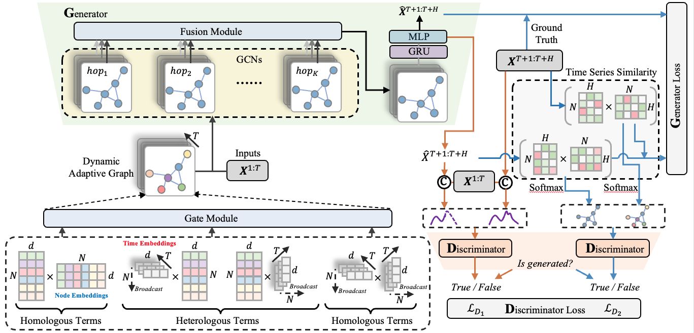
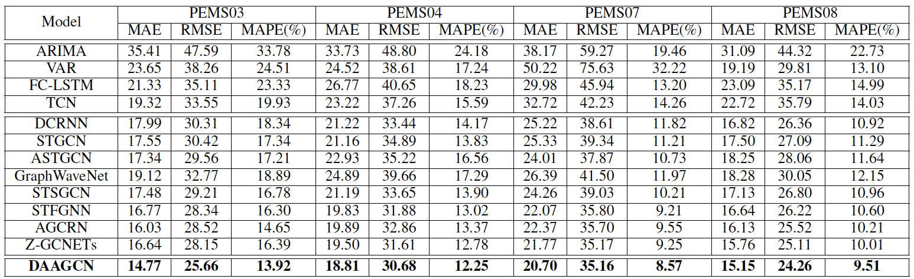
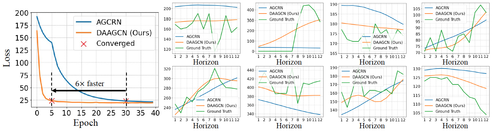
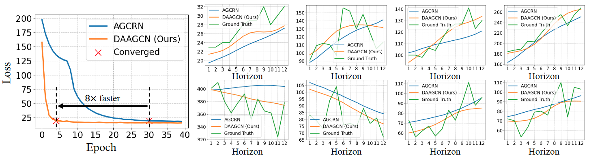

# DAAGCN: Dynamic Adaptive and Adversarial Graph Convolutional Network for Traffic Forecasting
Juyong Jiang, Binqing Wu, Ling Chen\*, Sunghun Kim

(\*) Corresponding Author.

This is our Pytorch implementation for the paper: "**[Dynamic Adaptive and Adversarial Graph Convolutional Network for Traffic Forecasting]()**".
Our framework is built based on framework of [AGCRN](https://github.com/LeiBAI/AGCRN). More useful repositories can be found in our [@AIM (DeepSE) Lab](https://github.com/AIM-SE).

## Paper Abstract
Traffic forecasting shed light on transportation management and public safety is a challenging task due to complicated spatial-temporal dependencies and dynamic correlation of traffic flow at different times. 
However, the existing methods still suffer from two critical limitations.
Firstly, many approaches typically utilize pre-defined spatial graphs (\texttt{static}) or adaptively learned adjacency graph (\texttt{fixed}) to capture dynamically evolving spatial-temporal dependencies in practical traffic system, which limits the flexibility and only captures shared patterns at the whole times, thus leading to sub-optimal spatial-temporal dependencies learning. Besides, most traffic forecasting models individually and independently consider the absolute error between ground truth and prediction at each timestep, which fails to maintain the \texttt{global property and statistics} of time series as a whole and results in trend discrepancy between ground truth and prediction. 
To handle these limitations, in this paper, we propose a novel \underline{D}ynamic \underline{A}daptive and \underline{A}dversarial \underline{G}raph \underline{C}onvolutional \underline{N}etwork (DAAGCN) which first combine Graph Convolution Networks (GCNs) with Generative Adversarial Networks (GANs) for traffic forecasting. 
Specifically, DAAGCN efficiently integrates time-varying embeddings with node embeddings to generate dynamic adaptive graphs as the generator which explicitly and adaptively infers spatial-temporal dependencies at each timestep. Then, two discriminators are designed to maintain the consistency of the global property and statistics of time series with ground truth at the sequence level and graph level, respectively. 
Extensive empirical studies with four real-world traffic benchmark datasets manifest that DAAGCN outperforms state-of-the-art by a significant margin on all datasets. 

<p align="center">
  
  <br>
  <b>Figure 1.</b> The framework of DAAGCN consists of a generator (Left) and two discriminators (Right). The generator combines a dynamic adaptive graph generation and convolution module with a GRU based forecasting module to generate predicted results. The two discriminators are two three-layer MLP for sequence-level accuracy and global property consistency, respectively.
</p>

## Installation
Make sure you have `Python>=3.8` and `Pytorch>=1.8` installed on your machine. 

* Pytorch 1.8.1
* Python 3.8.*

Modify the last line `prefix: /home/user/anaconda3/envs/daagcn` in `requirements.yml` according to your machine. 

Install python dependencies by running:

```bash
conda env create -f requirements.yml
```

## Datasets Preparation
In our work, we evaluate proposed models on four public traffic benchmark dataset, including: PEMS03, PEMS04, PEMS07, and PEMS08.
You can download them at [ASTGNN](https://github.com/guoshnBJTU/ASTGNN). Then, place them into `dataset` folder.

## Train and Test
**Step 1:**

You need to modify the following variables in `main.py` script to simplify arguments. 
```python
#*************************************************************************#
Mode = 'Train'
DATASET = 'PEMS04'      # PEMS03 or PEMS04 or PEMS07 or PEMS08
MODEL = 'DAAGCN'
ADJ_MATRIX = './dataset/{}/{}.csv'.format(DATASET, DATASET)
#*************************************************************************#
```

**Step 2:**

Modifying corresponding configuration for used dataset at `config/dataset_name.conf`.

**Step 3:**
```bash
python -u main.py --gpu_id=1 2>&1 | tee daagcn.log
```
or 

```
bash run.sh
```

Note that for descriptions of more arguments, please run `python main.py -h`. The logs of training and testing over four datasets can be found in 
[exp_log](https://github.com/juyongjiang/DAAGCN/tree/master/exp_log).

## Visualization
**Model Convergence Loss**
```bash
python vis_loss.py
```

**Horizon Prediction**
After training, the predicted results with 12 horizon will be saved in `log/dataset_name_xx/date_xx` which contains `best_model.pth`, 
`dataset_pred.npy`, and `dataset_true.npy`. Then, run the following command to visualize prediction with 12 horizon. 
```bash
python vis_pred.py
```

## Main Results
We conduct extensive experiments on four real-world traffic benchmark datasets. The experimental results show that DAAGCN outperforms the state-of-the-art methods by an average \textbf{14.13\%} relative MSE reduction, \textbf{12.81\%} relative RMSE reduction, and \textbf{17.18\%} relative MAPE reduction over all datasets (see Table 1). Besides, DAAGCN is the first attempt to combine GCNs with GANs for traffic forecasting task. It encapsulates the advantages of GCNs and GANs, and shows $\bm{6\times}$ at least faster convergence guarantees and correctness empirically (see Figure. 2 and Figure. 3). 

<p align="center">
  
  <br>
  <b>Table 1.</b> Prediction performance comparison of different models on four datasets.
</p>

<p align="center">
  
  <br>
  <b>Figure 2.</b> Convergence guarantees and correctness of DAAGCN on PEMS04. The left sub-figure illustrates that DAAGCN yields lower training loss during the whole training phase and convergence almost six times faster than AGCRN \cite{agcrn}. The right eight sub-figures, corresponding to eight nodes, show the predicted traffic flow of DAAGCN and AGCRN, and the ground truth in the future 12 time steps. We find that the predictions of DAAGCN are closer to reality, which is consistent across many nodes and datasets.
</p>

<p align="center">
  
  <br>
  <b>Figure 3.</b> Convergence guarantees and correctness of DAAGCN on PEMS08. The left sub-figure illustrates that the training loss of our DAAGCN yields lower training loss during the whole training phase and convergence almost eight times faster than AGCRN \cite{agcrn}. The right eight sub-figures, corresponding to eight nodes, show the predicted traffic flow of DAAGCN and AGCRN, and the ground truth in the future 12 time steps, which indicating the stronger prediction ability of DAAGCN.
</p>


## Bibtex
Please cite our paper if you find our code or paper useful:
```bibtex
@article{jiang2022dynamic,
  title={Dynamic Adaptive and Adversarial Graph Convolutional Network for Traffic Forecasting},
  author={Jiang, Juyong and Wu, Binqing and Chen, Ling\* and Kim, Sunghun},
  journal={Preprint},
  year={2022}
}
```

## Contact
Feel free to contact us if there is any question. (Juyong Jiang, juyongjiang@ust.hk; Bingqing Wu, binqingwu@cs.zju.edu.cn)


