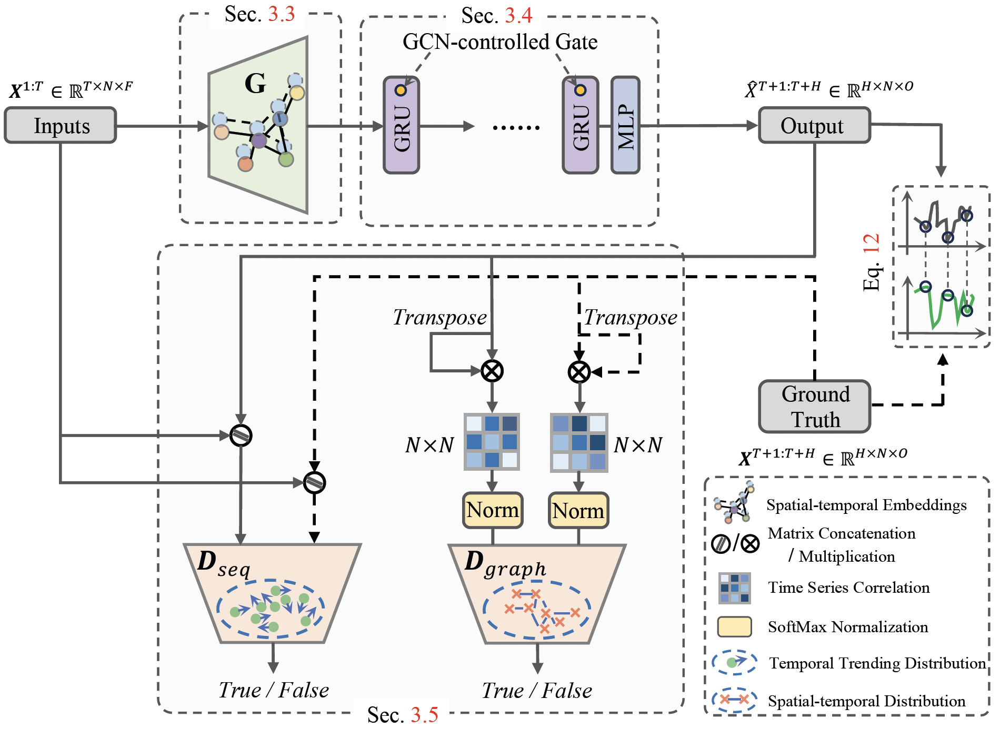
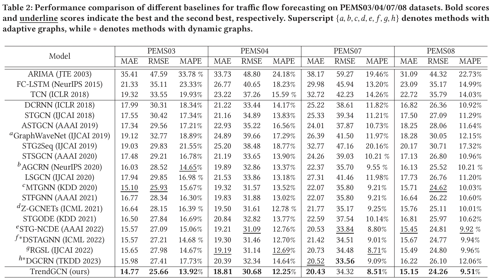
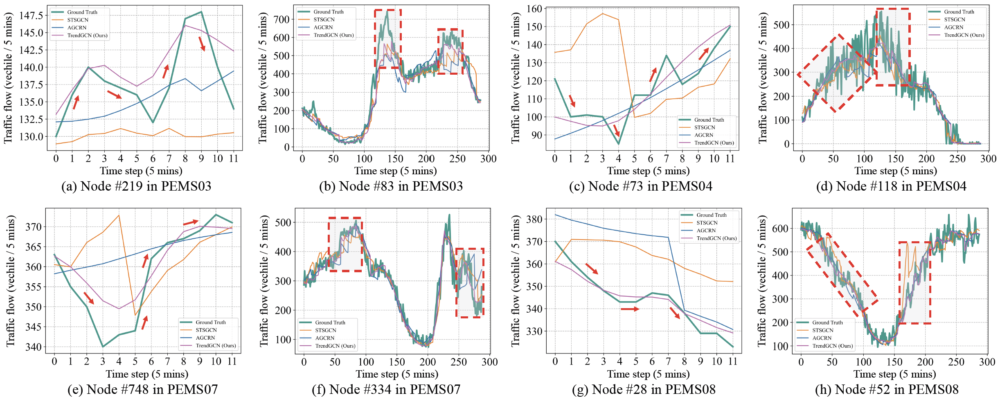
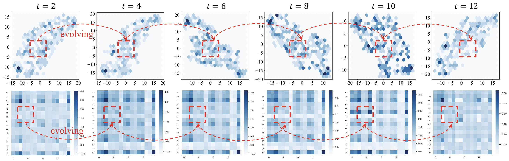

# Enhancing the Robustness via Adversarial Learning and Joint Spatial-Temporal Embeddings in Traffic Forecasting

[](./LICENSE)
[](https://www.python.org/downloads/release/python-390/)
[](https://github.com/psf/black)
[](https://arxiv.org/abs/2208.03063)

This is the official Pytorch implementation for our [CIKM 2023](https://uobevents.eventsair.com/cikm2023) paper: "[TrendGCN: Enhancing the Robustness via Adversarial Learning and Joint Spatial-temporal Embeddings in Traffic Forecasting](./TrendGCN_CIKM2023.pdf)".

<p align="center">
  
  <br>
  <b>Figure 1.</b> TrendGCN Model Architecture.
</p>

## Overview
```bash
TrendGCN
├── config                   # the configuration of six datasets
    ├── METR-LA.conf
    ├── PEMS-Bay.conf
    ├── PEMS03.conf
    ├── PEMS04.conf
    ├── PEMS07.conf
    └── PEMS08.conf
├── dataset                  # place six dataset folders
    ├── METR-LA
    ├── PEMS-Bay
    ├── PEMS03
    ├── PEMS04
    ├── PEMS07
    └── PEMS08
├── model
    ├── discriminator.py     
    └── generator.py         
├── utils
    ├── adj_dis_matrix.py    # construct adjacent matrix 
    ├── metrics.py           # evaluation metrics
    ├── norm.py              # data normalization
    └── util.py              # useful tools
├── dataloader.py            # load dataset
├── LICENSE                  
├── main.py                  # run
├── README.md                # detailed illustration of model training and testing
├── requirements.yml         # environment dependencies
└── trainer.py               # training and testing procedure
```


## Environment

Make sure you have `Python>=3.8` and `Pytorch>=1.8` installed on your machine. 

* Pytorch 1.8.1
* Python 3.8.*

Install python dependencies by running:

```bash
conda env create -f requirements.yml
# After creating environment, activate it
conda activate trendgcn
```

## Datasets Preparation
In our work, we evaluate proposed models on six real-world traffic benchmark dataset, including: PEMS03, PEMS04, PEMS07, PEMS08, PEMS-Bay, and METR-LA. Then, place them into `dataset` folder.

## Train and Test
**Step 1:**

Modifying the following variables in `main.py` script. 
```python
#********************************************************#
Mode = 'Train'     # or Test (loading best_model.pth to evaluate on test dataset)
DATASET = 'PEMS04' # PEMS03 or PEMS04 or PEMS07 or PEMS08
#********************************************************#
```

**Step 2:**

Modifying corresponding configuration for used dataset at `config/dataset_name.conf`, e.g., `config/PEMS04.conf`.

```python
[data]
num_nodes = 307
lag = 12
horizon = 12
val_ratio = 0.2
test_ratio = 0.2
tod = False
normalizer = std
column_wise = False
default_graph = True
...
```

**Step 3:**

```bash
python -u main.py --gpu_id=1 2>&1 | tee exps/PEMS04.log
```

Note that for descriptions of more arguments, please run `python main.py -h`. After training, the model will be evalutated on test dataset automatically. The results for 1 ~ 12 horizon prediction will be shown in terminal or can be found in the end of `exps/PEMS04.log`. 
```bash
Horizon 01, MAE: 17.16, RMSE: 27.69, MAPE: 11.2595%
Horizon 02, MAE: 17.57, RMSE: 28.50, MAPE: 11.4979%
Horizon 03, MAE: 17.98, RMSE: 29.21, MAPE: 11.7343%
Horizon 04, MAE: 18.29, RMSE: 29.76, MAPE: 11.9162%
Horizon 05, MAE: 18.54, RMSE: 30.23, MAPE: 12.0755%
Horizon 06, MAE: 18.80, RMSE: 30.68, MAPE: 12.2436%
Horizon 07, MAE: 19.04, RMSE: 31.09, MAPE: 12.4009%
Horizon 08, MAE: 19.24, RMSE: 31.43, MAPE: 12.5158%
Horizon 09, MAE: 19.43, RMSE: 31.76, MAPE: 12.6333%
Horizon 10, MAE: 19.62, RMSE: 32.05, MAPE: 12.7421%
Horizon 11, MAE: 19.82, RMSE: 32.37, MAPE: 12.8842%
Horizon 12, MAE: 20.20, RMSE: 32.88, MAPE: 13.1226%
Average Horizon, MAE: 18.81, RMSE: 30.68, MAPE: 12.2522%
```
More prediction results are stored in `exps/META-LA.log`, `exps/PeMS-BAY.log`, `exps/PEMS03.log`, `exps/PEMS07.log`, and `exps/PEMS08.log`.

## Experimental Results

The prediction average horizon results of TrendGCN on six datasets are as follows:
<!-- ||PEMS03| | |PEMS04| | |PEMS07| | |PEMS08| | 
|:-------:|:-------:|:-------:|:-------:|:-------:|:-------:|:-------:|:-------:|:-------:|:-------:|:-------:|:-------:|
|MAE|RMSE|MAPE|MAE|RMSE|MAPE|MAE|RMSE|MAPE|MAE|RMSE|MAPE|
|14.77 | 25.66 | 13.92% | 18.81 | 30.68 | 12.25% | 20.43 | 34.32 | 8.51% | 15.15 | 24.26 |9.51%|

||METR-LA| | |PeMS-BAY| |
|:-------:|:-------:|:-------:|:-------:|:-------:|:-------:|
|MAE|RMSE|MAPE|MAE|RMSE|MAPE|
|3.55 | 7.39 | 10.27% | 1.92 | 4.46 | 4.51%| -->
<p align="center">
    
</p>

## Visualization

<p align="center">
    
    <br><br>
    <b>Figure 2.</b> Comparison of short (12 steps)-(a)(c)(e)(g) and long (288 steps)-(b)(d)(f)(h) term prediction curves between STSGCN, AGCRN, and our TrendGCN on a snapshot of the test data of four datasets. Note that, the predicted time series for the whole day period (288 steps) is simply obtained by concatenating all the short-term predictions (12 steps) along the time axis (and remove overlaps), which is a common practice widely used in existing literatures, so that a better visualization of the prediction quality during different time of the day can be presented. 
</p>

<p align="center">
    
    <br><br>
    <b>Figure 3.</b> Visualization of 2D projection of UMAP on spatial embeddings (Upper) and the heatmap of learned graphs (Lower) at t = {2, 4, 6, 8, 10, 12} time steps.
</p>


## Citation
If you use the data or code in this repo, please cite the repo.

```
@article{jiang2022dynamic,
  title={Enhancing the Robustness via Adversarial Learning and Joint Spatial-Temporal Embeddings in Traffic Forecasting},
  author={Jiang, Juyong and Wu, Binqing and Chen, Ling and Zhang, Kai and Kim, Sunghun},
  journal={arXiv preprint arXiv:2208.03063},
  year={2022}
}
```