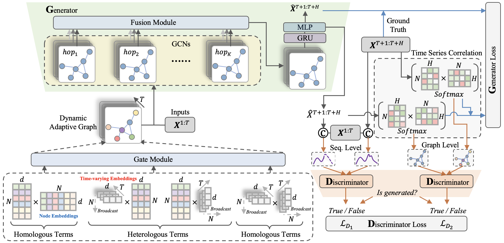

# DAAGCN: Dynamic Adaptive and Adversarial Graph Convolutional Network for Traffic Forecasting
Juyong Jiang\*, Binqing Wu\*, Ling Chen†, Sunghun Kim .

(\*) Equal Contribution, (†) Corresponding Author.

This is our Pytorch implementation for the paper: "[Dynamic Adaptive and Adversarial Graph Convolutional Network for Traffic Forecasting](https://arxiv.org/abs/2208.03063)".
Our framework is built based on framework of [AGCRN](https://github.com/LeiBAI/AGCRN). More useful repositories can be found in our [HKUST@DeepSE Lab](https://github.com/AIM-SE).

## Paper Abstract
Traffic forecasting is challenging due to dynamic and complicated spatial-temporal dependencies. However, existing methods still suffer from two critical limitations. Firstly, many approaches typically utilize static pre-defined or adaptively learned spatial graphs to capture dynamic spatial-temporal dependencies in the traffic system, which limits the flexibility and only captures shared patterns for the whole time, thus leading to sub-optimal performance. In addition, most approaches individually and independently consider the absolute error between ground truth and predictions at each time step, which fails to maintain the global properties and statistics of time series as a whole and results in trend discrepancy between ground truth and predictions. To this end, in this paper, we propose a Dynamic Adaptive and Adversarial Graph Convolutional Network (DAAGCN), which combines Graph Convolution Networks (GCNs) with Generative Adversarial Networks (GANs) for traffic forecasting. Specifically, DAAGCN leverages a universal paradigm with a gate module to integrate time-varying embeddings with node embeddings to generate dynamic adaptive graphs for inferring spatial-temporal dependencies at each time step. Then, two discriminators are designed to maintain the consistency of the global properties and statistics of predicted time series with ground truth at the sequence and graph levels. Extensive experiments on four benchmark datasets manifest that DAAGCN outperforms the state-of-the-art by average 5.05%, 3.80%, and 5.27%, in terms of MAE, RMSE, and MAPE, meanwhile, speeds up convergence up to 9 times.

<p align="center">
  
  <br>
  <b>Figure 1.</b> The model architecture of the proposed DAAGCN.
</p>

## Installation
Clone this project:

```bash
git clone git@github.com:juyongjiang/DAAGCN.git
```

Make sure you have `Python>=3.8` and `Pytorch>=1.8` installed on your machine. 

* Pytorch 1.8.1
* Python 3.8.*

Install python dependencies by running:

```bash
conda env create -f requirements.yml
# After creating environment, activate it
conda activate daagcn
```

## Datasets Preparation
In our work, we evaluate proposed models on four public traffic benchmark dataset, including: PEMS03, PEMS04, PEMS07, and PEMS08.
You can download them at [ASTGNN](https://github.com/guoshnBJTU/ASTGNN). Then, place them into `dataset` folder.

## Train and Test
**Step 1:**

You need to modify the following variables in `main.py` script. 
```python
#********************************************************#
Mode = 'Train'
DATASET = 'PEMS04' # PEMS03 or PEMS04 or PEMS07 or PEMS08
MODEL = 'DAAGCN'
#********************************************************#
```

**Step 2:**

Modifying corresponding configuration for used dataset at `config/dataset_name.conf`, e.g., `config/PEMS04.conf`.

```python
[data]
num_nodes = 307
lag = 12
horizon = 12
val_ratio = 0.2
test_ratio = 0.2
tod = False
normalizer = std
column_wise = False
default_graph = True
...
```

**Step 3:**
```bash
python -u main.py --gpu_id=1 2>&1 | tee daagcn.log
```
or 

```
bash run.sh
```

Note that for descriptions of more arguments, please run `python main.py -h`. The logs of testing results on four datasets reported in our paper can be found in [results](https://github.com/juyongjiang/DAAGCN/tree/master/results).

## Visualization
```bash
$ tree
.
├── visualize
    └── PEMS04
        ├── DAAGCN_PEMS04_pred.npy
        ├── DAAGCN_PEMS04_true.npy
        └── DAAGCN_PEMS04_val_loss.txt
...
``` 
After training, the training loss will be saved in root path. Besides, the predicted results with 12 horizon will be saved in `log/dataset_name_xx/date_xx` which contains `best_model.pth`, `dataset_pred.npy`, and `dataset_true.npy`. Place these files in the format of above path tree. Then, run the following script to visualize model convergence loss and prediction with 12 horizon in [Colab](https://colab.research.google.com/?utm_source=scs-index). 
```bash
vis_loss_pred.ipynb
```

## Bibtex
Please cite our paper if you find our code or paper useful:
```bibtex
@article{jiang2022dynamic,
  title={Dynamic Adaptive and Adversarial Graph Convolutional Network for Traffic Forecasting},
  author={Jiang, Juyong and Wu, Binqing and Chen, Ling and Kim, Sunghun},
  journal={arXiv preprint arXiv:2208.03063},
  year={2022}
}
```

## Contact
Feel free to contact us if there is any question. (Juyong Jiang, juyongjiang@ust.hk; Binqing Wu, binqingwu@cs.zju.edu.cn)


